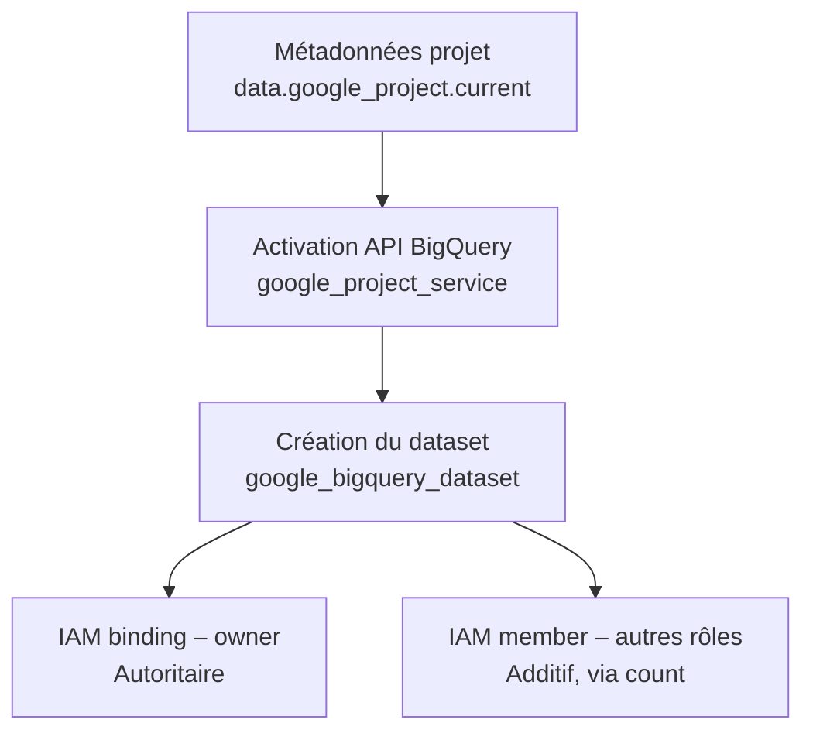

# Module Terraform — `bigquery_dataset`
 
## Objectif
 
Ce module provisionne un **dataset BigQuery** sur GCP, avec activation automatique de l'API nécessaire et gestion des accès IAM au niveau du dataset (principe de **least privilege**).
 
Il est conçu pour être réutilisable sur plusieurs environnements (dev/test/prod) sans modification du code.
 
---
 
## Schéma du flux
 

 
*Rendu automatique sur GitLab/GitHub. À défaut, voir le schéma partagé dans la conversation Claude.*
 
---
 
## Ressources créées
 
| # | Ressource | Type | Rôle |
|---|-----------|------|------|
| 1 | `data.google_project.current` | Data source | Récupère les métadonnées du projet GCP actif (project_id, number) |
| 2 | `google_project_service.bigquery-api` | Resource | Active l'API `bigquery.googleapis.com` sur le projet |
| 3 | `google_bigquery_dataset.dataset` | Resource | Crée le dataset BigQuery |
| 4 | `google_bigquery_dataset_iam_binding.owner` | Resource | Attribue le rôle owner du dataset (gestion **autoritaire**) |
| 5 | `google_bigquery_dataset_iam_member.grp_roles` | Resource | Attribue d'autres rôles (viewer, editor...) à plusieurs membres (gestion **additive**) |
 
---
 
## Détail des blocs
 
### 1. Métadonnées du projet
 
```hcl
data "google_project" "current" {}
```
 
Récupère automatiquement les informations du projet configuré dans le provider (via `project_id`, `number`, `name`), sans avoir à les hardcoder. Utilisé plus loin dans le module pour construire des références dynamiques (IDs, IAM, etc.).
 
### 2. Activation de l'API BigQuery
 
```hcl
resource "google_project_service" "bigquery-api" {
  project            = data.google_project.current.project_id
  service            = "bigquery.googleapis.com"
  disable_on_destroy = false
}
```
 
Active l'API BigQuery, prérequis indispensable avant toute création de ressource BigQuery sur le projet.
 
⚠️ **`disable_on_destroy = false`** : lors d'un `terraform destroy` de ce module, l'API **reste active** sur le projet. Ce choix évite de désactiver une API potentiellement utilisée par d'autres ressources/équipes sur le même projet.
 
### 3. Création du dataset
 
```hcl
resource "google_bigquery_dataset" "dataset" {
  dataset_id = var.dataset_id
  location   = var.location
  depends_on = [google_project_service.bigquery-api]
}
```
 
- `dataset_id` : identifiant unique du dataset dans le projet (utilisé dans les requêtes SQL sous la forme `projet.dataset.table`)
- `location` : région de stockage physique des données. **Champ immuable** après création — à valider avec les contraintes de conformité (ex. résidence des données en zone EU) avant le premier apply
- `depends_on` explicite : garantit que l'API BigQuery est bien active avant la tentative de création du dataset, même en l'absence de dépendance implicite détectable par Terraform
### 4. Gestion du rôle Owner (mode autoritaire)
 
```hcl
resource "google_bigquery_dataset_iam_binding" "owner" {
  dataset_id = google_bigquery_dataset.dataset.dataset_id
  role       = "roles/bigquery.dataOwner"
  members    = var.owners
}
```
 
Définit la **liste complète et exclusive** des identités disposant du rôle owner sur ce dataset.
 
🔴 **Point d'attention critique** : ce bloc est **autoritaire**. À chaque `apply`, Terraform aligne l'état réel sur cette liste — tout membre ajouté au rôle `dataOwner` par un autre moyen (console GCP, autre module Terraform) en dehors de ce bloc sera **supprimé automatiquement**.
 
→ Ce mode est adapté uniquement si ce module est la **seule source de vérité** pour la gestion du rôle owner sur ce dataset.
 
### 5. Gestion des autres rôles (mode additif)
 
```hcl
resource "google_bigquery_dataset_iam_member" "grp_roles" {
  count      = length(var.additional_roles)
  dataset_id = google_bigquery_dataset.dataset.dataset_id
  role       = var.additional_roles[count.index].role
  member     = var.additional_roles[count.index].member
}
```
 
Attribue des rôles (ex. `dataViewer`, `dataEditor`) à un ou plusieurs membres, **sans écraser** les autres attributions existantes sur ces mêmes rôles.
 
✅ Recommandé pour les rôles partagés entre plusieurs équipes ou services (ex. accès en lecture pour une équipe data, accès en écriture pour un service account Composer/Dataproc), là où plusieurs acteurs peuvent contribuer aux accès dans le temps.
 
---
 
## `_iam_binding` vs `_iam_member` — à retenir
 
| Ressource | Comportement | Cas d'usage recommandé |
|---|---|---|
| `*_iam_binding` | **Autoritaire** : remplace toute la liste des membres pour un rôle donné | Rôle géré exclusivement par ce module (ex. owner unique) |
| `*_iam_member` | **Additif** : ajoute un membre à un rôle sans toucher aux autres | Rôles partagés entre plusieurs modules/équipes (ex. viewer, editor) |
 
> Analogie : `_iam_binding` fonctionne comme une liste fermée ("voici EXACTEMENT qui a ce rôle, tout le reste est retiré"). `_iam_member` ajoute simplement quelqu'un à la liste existante, sans y toucher.
 
⚠️ Mélanger `_binding` et `_member` sur le **même rôle** dans des modules différents provoque des conflits silencieux (écrasements mutuels à chaque apply). Toujours vérifier qu'un seul mécanisme gère un rôle donné.
 
---
 
## Bonnes pratiques appliquées dans ce module
 
- **Least privilege** : séparation claire entre le rôle owner (accès exclusif, mode autoritaire) et les autres rôles (accès partagés, mode additif)
- **Portabilité** : aucun project_id en dur, tout est dérivé de `data.google_project.current` ou de variables
- **Idempotence** : l'activation de l'API fait partie du module — aucune dépendance à une activation manuelle préalable
- **Sécurité API** : `disable_on_destroy = false` évite un impact collatéral sur d'autres ressources du projet lors d'un destroy
---
 
## Points de vigilance pour les évolutions futures
 
- Si la liste de `var.additional_roles` est amenée à changer fréquemment (ajout/suppression au milieu de la liste), envisager de remplacer `count` par `for_each` sur une map/set pour éviter les recréations de ressources liées au recalcul des index
- Valider la `location` du dataset en amont avec les équipes concernées (conformité, latence avec les autres services comme Dataproc) — ce champ n'est pas modifiable après coup
- Documenter clairement dans le repo qui (quel module/équipe) est responsable de la gestion de chaque rôle IAM sur ce dataset, pour éviter les conflits `_binding`/`_member`
---
 
## Variables attendues (à adapter selon le fichier `variables.tf` réel du module)
 
| Variable | Type | Description |
|---|---|---|
| `dataset_id` | `string` | Identifiant du dataset BigQuery |
| `location` | `string` | Région de stockage (ex. `EU`, `US`, `europe-west1`) |
| `owners` | `list(string)` | Liste des membres avec le rôle owner (format `user:`, `group:`, `serviceAccount:`) |
| `additional_roles` | `list(object({ role = string, member = string }))` | Liste des rôles/membres additionnels (viewer, editor, etc.) |
 